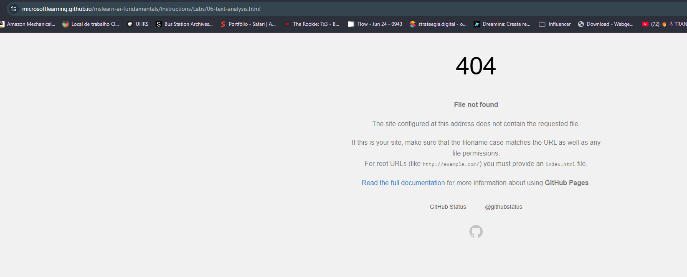
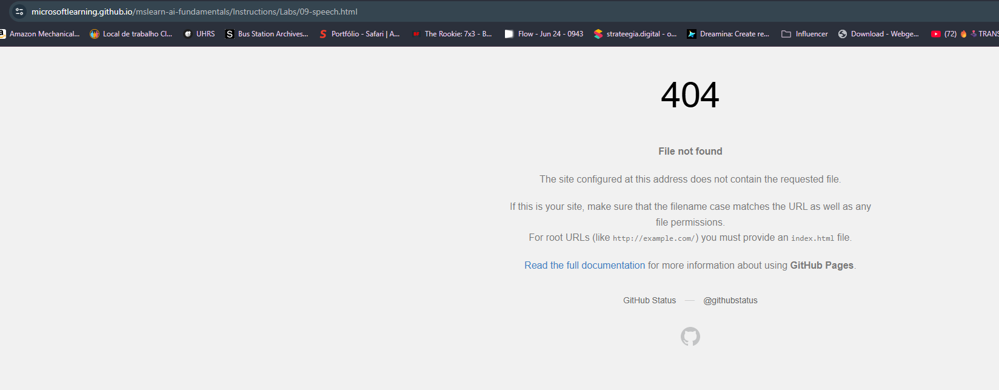

# DIO-Azure-Speech-Language-Desafio

O desenvolvimento deste projeto foi focado na análise técnica e arquitetural dos serviços Azure AI Speech e Azure AI Language, conforme requerido pelo programa da DIO.

Devido a um impedimento técnico persistente no acesso ao portal da ferramenta online, especificamente em https://speech.microsoft.com/portal/, o processo de login resultava repetidamente em um redirect loop (conforme detalhado na Imagem 1).

Como tambem on links úteis deram problema conforme a imagem 2 e 3.

Essa situação impediu a obtenção das chaves de credencial necessárias e, consequentemente, a realização de testes práticos no ambiente online.

Em virtude dessa limitação, a metodologia do projeto foi adaptada. Os esforços foram direcionados para o estudo aprofundado da documentação oficial (consultando https://learn.microsoft.com/pt-br/azure/ai-services/speech-service/captioning-concepts?pivots=programming-language-csharp) e a análise do repositório de amostras do SDK (disponível em https://github.com/Azure-Samples/cognitive-services-speech-sdk/tree/master/scenarios).

Dessa forma, foi possível consolidar a compreensão conceitual e a arquitetura de implementação do SDK, validando o conhecimento exigido pelo desafio.

## O que Aprendi sobre Legendagem (Azure AI Speech)

Eu me aprofundei em como o Azure faz a legendagem de áudio, que é basicamente a transcrição do que está sendo falado.

1. O Segredo da Sincronização Perfeita
   Não basta só transformar a fala em texto! Para uma legenda funcionar bem (como as do YouTube), o serviço de Fala (Speech) do Azure precisa devolver três coisas:

O Texto (o que foi falado).

Onde Começa (Offset): O momento exato em que a pessoa começou a falar aquela frase.

Duração: Quanto tempo a pessoa levou para falar aquela frase.

Esses dados de tempo são a chave para sincronizar o texto com o áudio. Além disso, o texto precisa ser salvo em formatos padrão de legenda, como SRT ou WebVTT.

2. Deixando as Legendas Estáveis
   Em uma transmissão ao vivo, o texto está sendo reconhecido em tempo real. O serviço às vezes muda uma palavra enquanto está "ouvindo", o que faz a legenda piscar ou mudar rapidamente (o que chamamos de flickering).

Aprendi que existe uma configuração secreta: a propriedade SpeechServiceResponse_StablePartialResultThreshold. Essa configuração diz ao Azure: "Espere um pouco e só me entregue o texto quando tiver certeza."

Isso garante que a legenda na tela seja estável e de alta qualidade para quem está assistindo, mesmo que demore uma fração de segundo a mais.

## Como o Código Funciona (Implementação via SDK)

Analisando a estrutura do código de exemplo, entendi o fluxo lógico para usar o serviço de Fala:

Primeiro, você precisa de um objeto de configuração (SpeechConfig) onde você insere as chaves de acesso (que não consegui pegar, mas sei onde elas vão!).

Começar a Ouvir (Processamento): Depois, você inicia um objeto chamado SpeechRecognizer. É ele que efetivamente faz o trabalho de ouvir o áudio.

Capturar os Resultados (Tratamento de Eventos): O código precisa estar pronto para lidar com dois tipos de resultados:

Recognizing (Parcial): Quando o Azure está no meio do processo e te manda o texto provisório.

Recognized (Final): O resultado final e pronto, com o texto e as informações de tempo (Offset/Duração) que precisamos para a legenda.

é interessante tambem que eles tem um manual para treinar o metodo de metodod e compreensão de intenções de linguagem natural, para o unity engine conforme o link: https://learn.microsoft.com/pt-br/training/modules/azure-speech-services-tutorials-mrtk/9-exercise-set-up-intent-natural-language-understand
